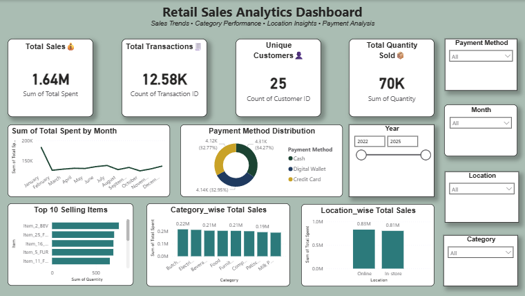

# Retail Sales Data Analysis

## 📌 Objective

Analyze retail sales data to identify trends, revenue patterns, and top-performing products.

## 🛠️ Tools Used

* Python
* Pandas
* Matplotlib
* Seaborn

## 📊 Key Analysis

* Monthly sales trends
* Top-selling products
* Revenue distribution
* Category-wise performance

## 📁 Dataset

Retail_Cleaned.csv

## 📈 Conclusion

This project provides insights into customer purchasing behavior and supports data-driven decision making.

## 📊 Power BI Dashboard

This dashboard provides insights into:
- Sales trends over time
- Top-performing products
- Category-wise performance
- Payment method analysis
